## Charlie Brown detector (A YOLO IA Model)

This Yolo Model has been trained to detect the character of snoppy strips [Charlie Brown](https://en.wikipedia.org/wiki/Charlie_Brown) with all his designs.

This model is based of the [YOLO26](https://huggingface.co/Ultralytics/YOLO26) model of Ultranalytics and trained locally with a dataset of 61 images with all the aparences of the character since the 50s to the 2020s (This model hasn't been trainer with the desing in [Li'l Folks](https://en.wikipedia.org/wiki/Li%27l_Folks))

### Training

This model has been trained with a small dataset with only 61 images and 92 abbotations, the objective was train a model this the less images posible and see how precise is.

This model has a precision of about 86% in most of the cases but if you to detect all the instance of Charlie Brown the precision falls, so you cannot detect all the instance, only de 86%

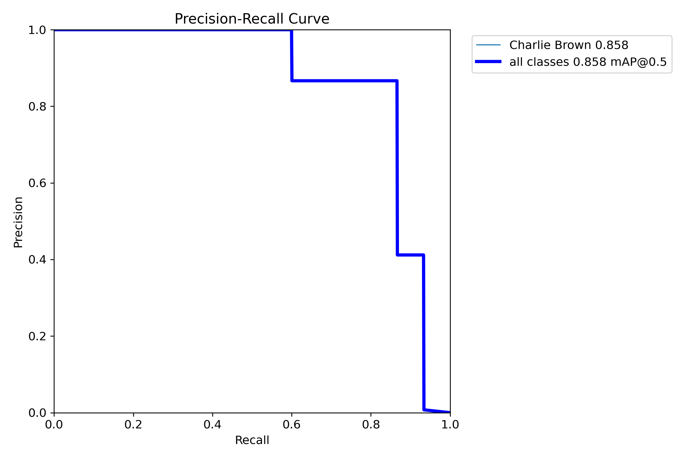

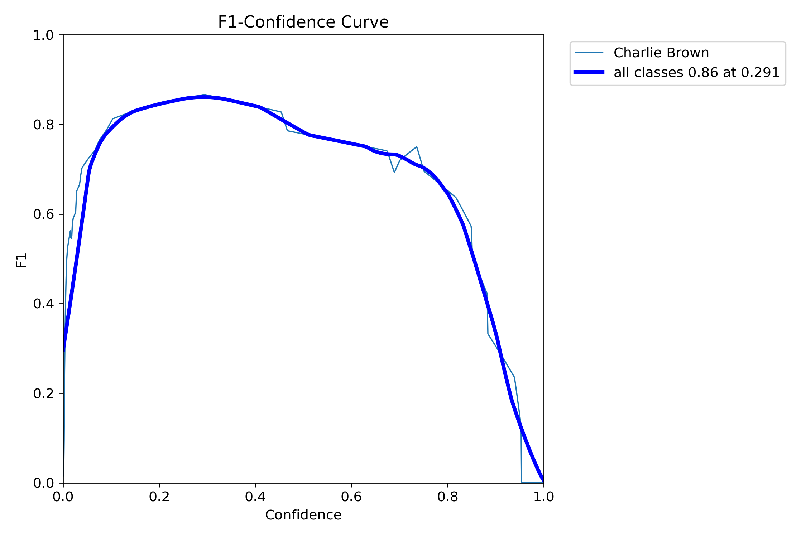

In the confusion matrix yoy can see the model has accert 13 of the 15 of the cases (87%), the 2 others cases was detected as background.

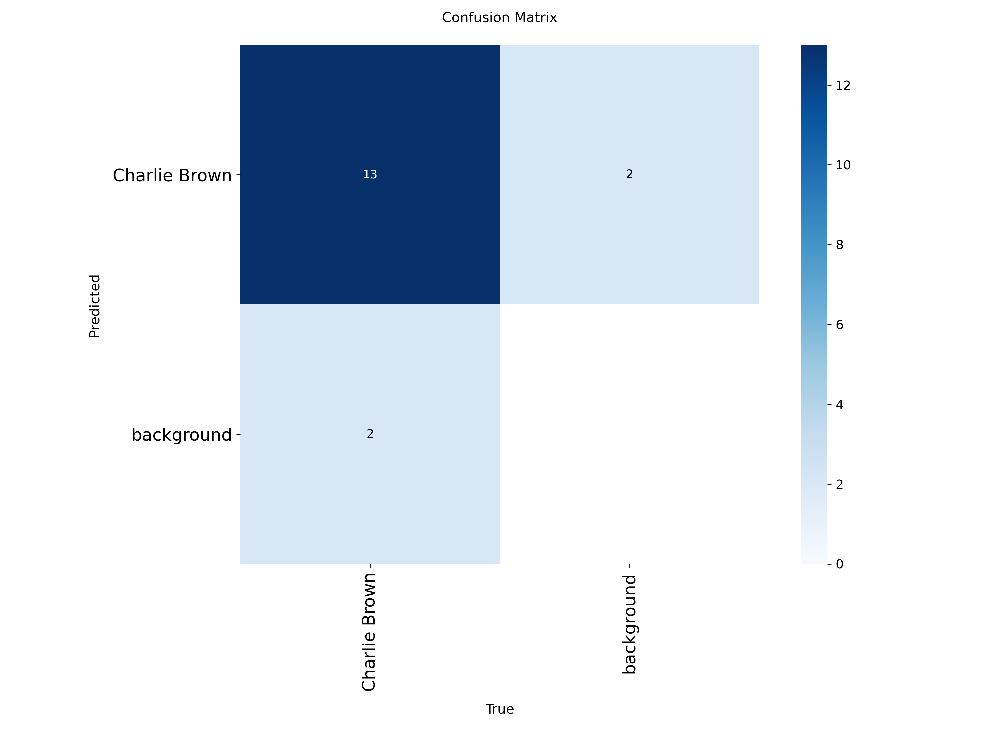

But the model has a little overfitting with the boxes and cannot create new detection boxes, it memorice the boxes on the training this is normal in a little model like this.

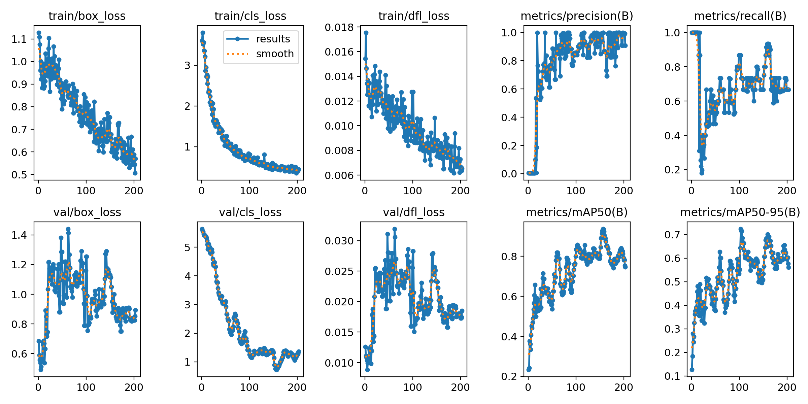

### Results

__All the episodes and comic strips was selected as Random__

In the most of the cases the result of the Image analysis is very good, in images with a good resolution it hasn't have problems detecting the character even if there are a lot of him in the images, some Examples:

- The 50s

### In this image can detect to Charlie Brown in 3 of the cases, but miss the third one.

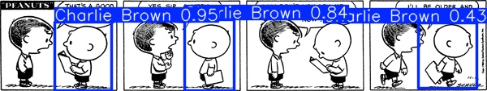

### In this image in the first 2 strips it confuse Patty with Charlie Brown, they design is too similar

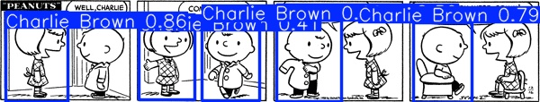

### In this strip can detect Charlie Brown without problems, this is his first apperance with the polo with the zig-zag patter, it helps to reconoce him. 
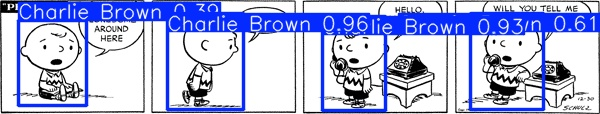

- The 60s

### In this strip can detect Charlie Brown in 6 of the 8 cases, and for some reason the model says that a cloud is him, strange, I don't know what.

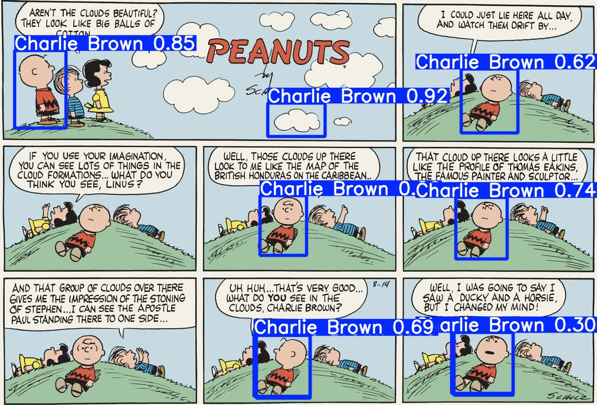

### In this strip can detect Charlie Brown in 9 of the 10 cases.

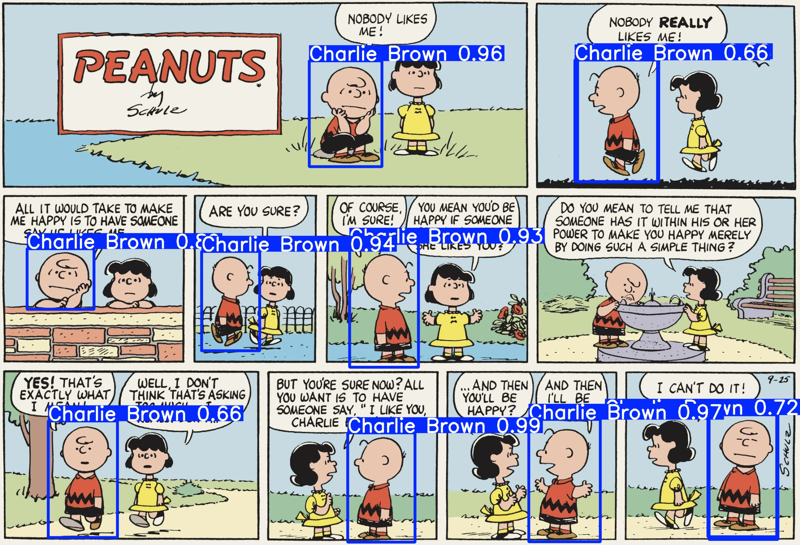

### In this strip Charlie Brown was detected in all the cases.

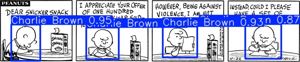

- The 70-80-90s

### In this strip Charlie Brown can only be detected once, I supponse that I should train the model with all the gags of the comic, the model was trained with Charlie Brown launching a ball, the first one, that's the reson because can detect it.
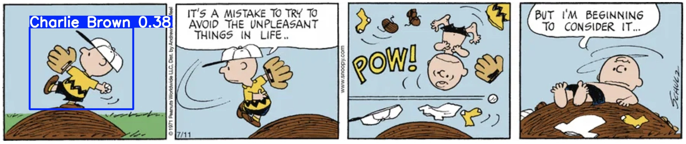

### In this strip can be detected in 6 of the 8 cases

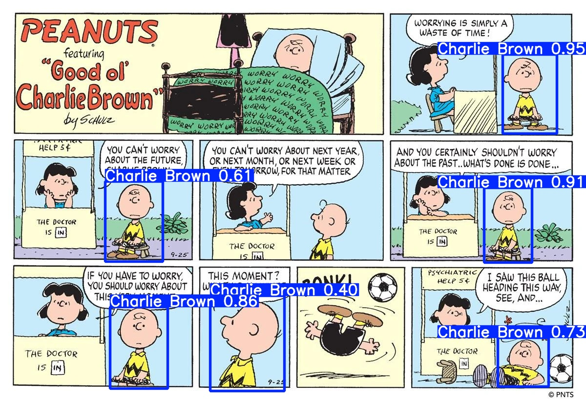

### In this can detect Charlie Brown in 2 of the cases.

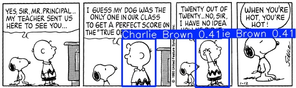

- Old TV shows

### In some cases it says that other characters like Linus or Shroeder are Charlie Brown if the image has low resolution.

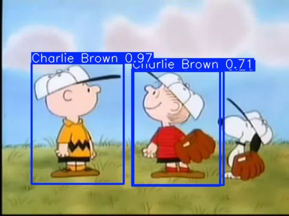

### If the image has a better resolution it works perfectly.

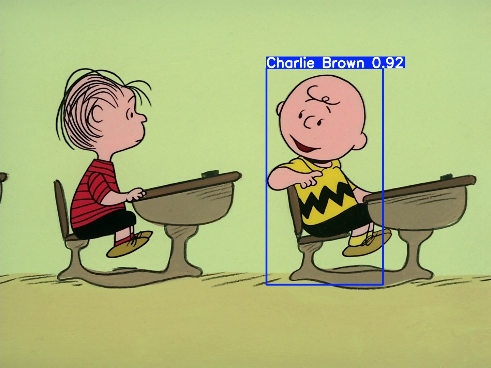

- Modern TV shows

### The new design of Charlie Brown can be detected perfectly

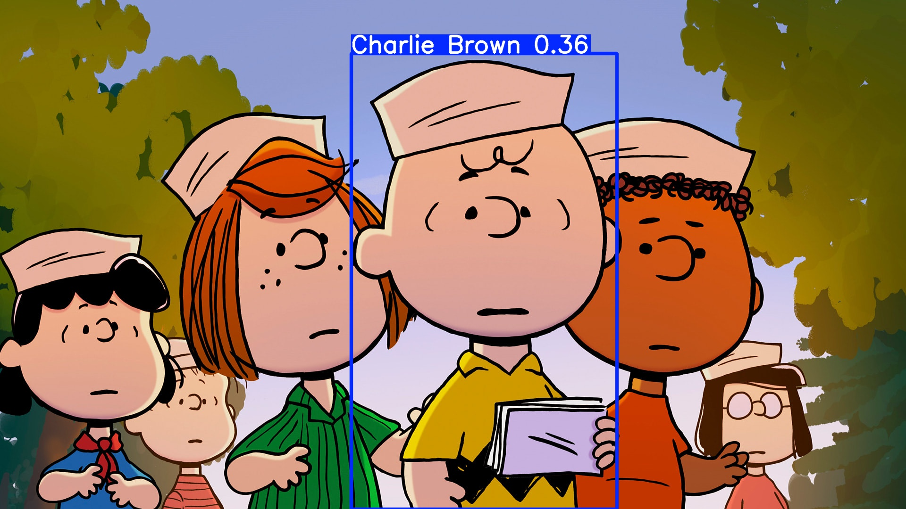

### But can be confused with other characters.

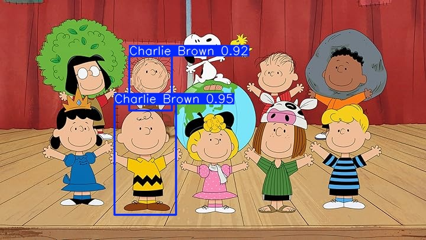

- Others

### Can detect Charlie Brown plushes and figures.

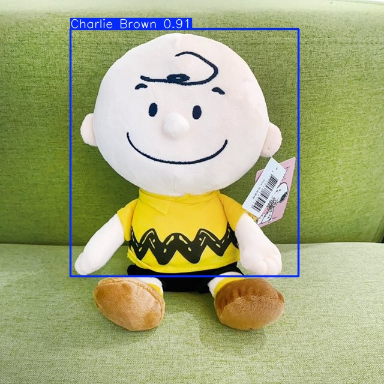

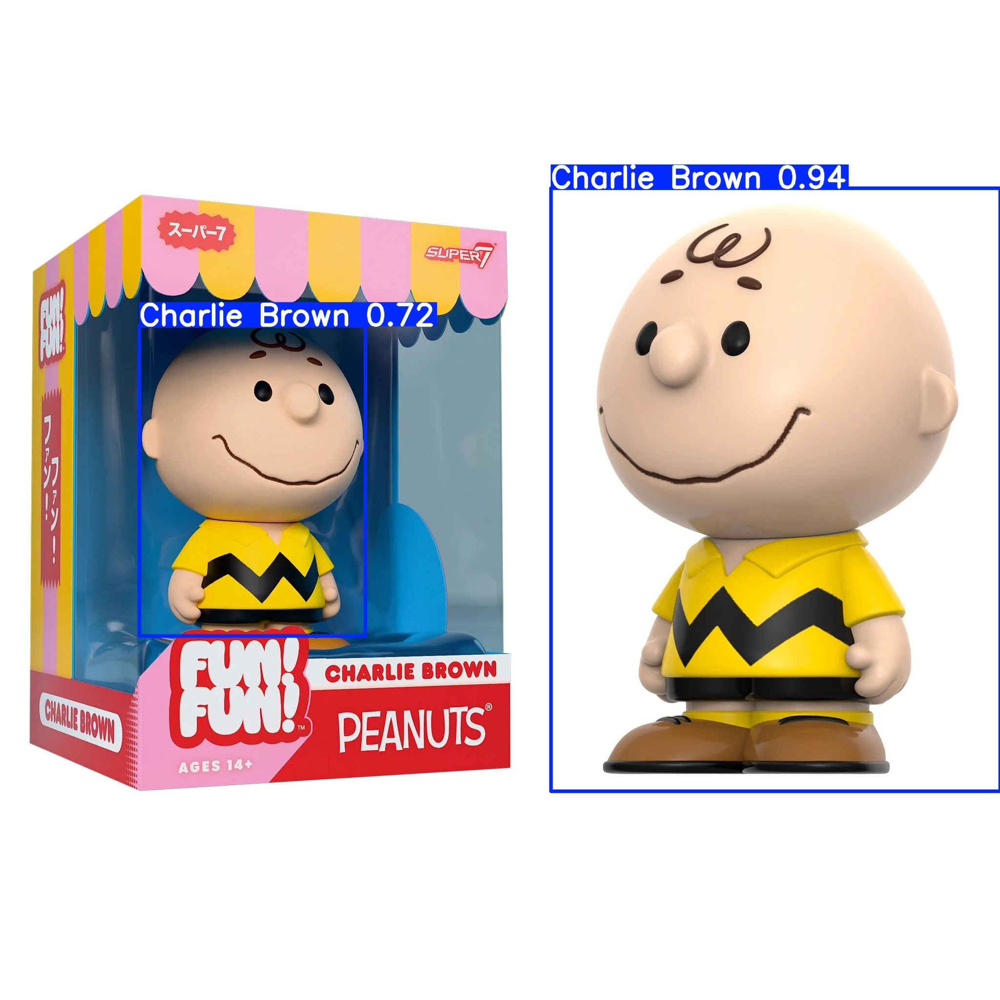

